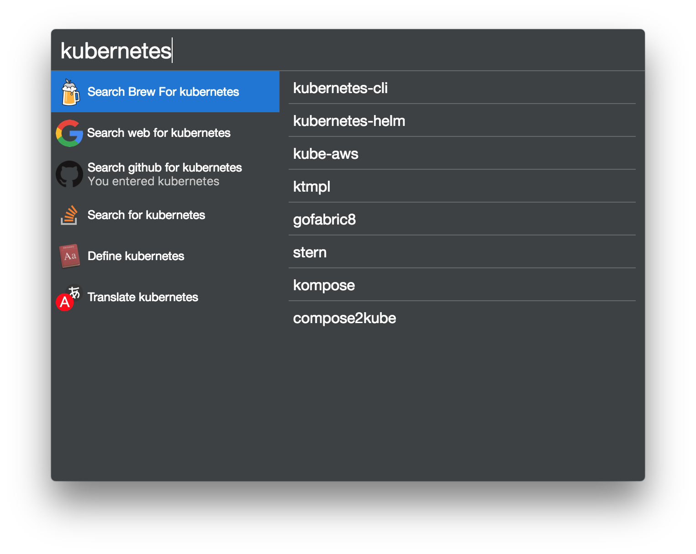

# Cerebro-Brew

> It is a plugin for [Cerebro app](http://www.cerebroapp.com) that searches for homebrew formulas

## Usage

In Cerebro, type brew followed by any term, and the Homebrew plugin will show some suggestions:

<kbd>Return</kbd> - Open a terminal window with the install command entered.

<kbd>cmd+c</kbd> - Copy the install command eg. `brew install formula`

Cerebro needs `Acceessibility` access to be able to use the non-executing version when using `Terminal`. You can enable it in `System Preferences > Security & Privacy > Privacy > Accessibility`.

## Settings
You can change the terminal used by the plugin in the settings.
The two options are:
- `Terminal` - Uses the default terminal
- `iTerm` - Uses iTerm

You can also enable direct execution of the install command in the settings.
By default, the plugin will open a terminal window with the install command entered.

## Related

* [Cerebro](https://github.com/cerebroapp/cerebro) – main repo for Cerebro app;
* [Cerebro Tools](https://github.com/cerebroapp/cerebro-tools) – package with tools to simplify package creation;

## License

MIT © [Luis Davim](https://github.com/luisdavim)
